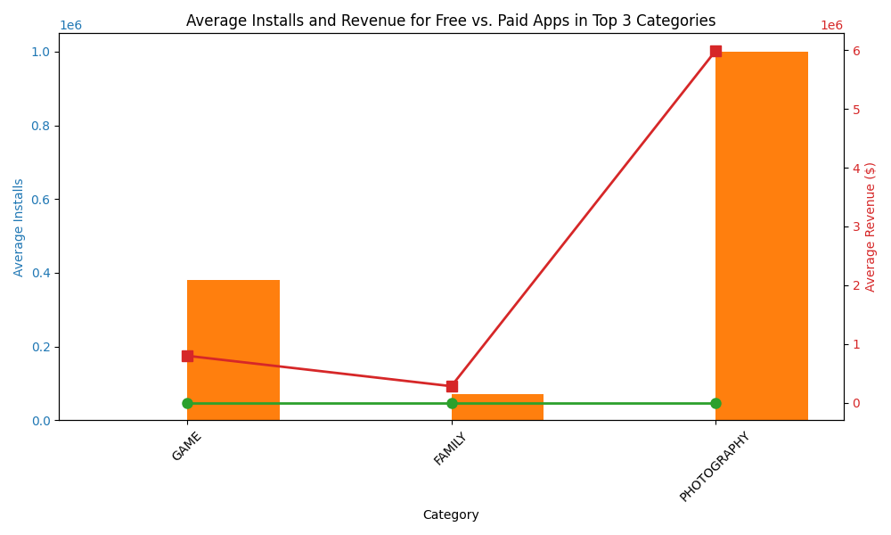

Here's your updated **`README.md`** file with:

* 📸 **Screenshots** section
* 🌐 **Netlify live link**
* Better organized layout

---

### ✅ Final `README.md`

```markdown
# 📊 Google Play Store Analytics Internship Dashboard

This project was developed as part of an internship with **NullClass**, focused on analyzing the Google Play Store dataset using Python and visualizing the results in a custom HTML/CSS/JavaScript dashboard.

---

## 🌐 Live Project URL

🔗 **Hosted on Netlify:**  
[👉 View Dashboard Live](https://your-netlify-link.netlify.app)  
*(Replace the above URL with your actual Netlify deployment link)*

---

## 📁 Project Structure

```

GooglePlayAnalytics-Internship/
├── data/
│   ├── Play Store Data.csv
│   └── User Reviews.csv
│
├── web\_dashboard/
│   ├── index.html
│   ├── style.css
│   ├── js/
│   │   └── scripts.js
│   └── assets/
│       ├── wordcloud.png
│       ├── dual\_axis\_chart.png
│       └── bubble\_chart.png
│
├── wordcloud.py
├── play\_store\_dual\_axis.py
├── bubble\_chart\_analysis.py
├── README.md
└── requirements.txt

````

---

## 🎯 Tasks Overview

### ✅ Task 1: Word Cloud - Health & Fitness (5-Star Reviews)
- Filters:
  - Reviews with 5 stars
  - "Health & Fitness" category
  - Stopwords and app names removed
- Output: `wordcloud.png`  
- If no data matches, a placeholder image is shown.

### ✅ Task 2: Dual Axis Chart - Free vs Paid (Top 3 Categories)
- Compares **average installs** and **revenue** for free vs. paid apps
- Filters:
  - Installs ≥ 10,000
  - Revenue ≥ $10,000
  - Android version > 4.0
  - Size > 15 MB
  - Content Rating = Everyone
  - App name ≤ 30 characters
- Visibility: **Only visible between 1 PM – 2 PM IST**

### ✅ Task 3: Bubble Chart - Size vs Rating (With Translations & Time Filter)
- Filters:
  - Rating > 3.5
  - Reviews > 500
  - App name doesn't contain letter "S"
  - Sentiment subjectivity > 0.5
  - Installs > 50K
  - Categories: Game, Beauty, Business, Comics, Communication, Dating, Entertainment, Social, Event
- Highlights:
  - Game category is pink
  - Beauty → Hindi | Business → Tamil | Dating → German
- Visibility: **Only visible between 5 PM – 7 PM IST**

---

## 📸 Screenshots

### 🔹 Task 1 - Word Cloud


### 🔹 Task 2 - Dual Axis Chart


### 🔹 Task 3 - Bubble Chart


---

## ⚙️ Requirements

Python dependencies for data processing and visualization:

```txt
pandas
numpy
matplotlib
seaborn
wordcloud
nltk
````

Install all dependencies using:

```bash
pip install -r requirements.txt
```

---

## 🚀 Deployment Instructions (Netlify)

1. Go to [Netlify](https://netlify.com/)
2. Drag and drop the `web_dashboard` folder into Netlify drop zone
3. Publish and share the link

---

## 👨‍💻 About the Intern

* Name: **Naveen Tiwari**
* Internship Organization: **NullClass**
* Role: Self-directed completion of all internship tasks using Python, HTML, CSS, and JavaScript
* No mentor support was used — all research was independently done

---

## 📬 Contact

* 📧 Email: [naveen.tiwari@example.com](mailto:naveen.tiwari@example.com) *(Replace with your actual email if needed)*
* 💼 GitHub: [github.com/yourusername](https://github.com/yourusername) *(Update if public repo)*

---

> 📌 Note: This project is submitted for educational and internship evaluation purposes. Redistribution without permission is not allowed.

```

---

Let me know:
- Your **actual Netlify URL**
- If you'd like to include **GIFs**, **video demo**, or **responsive design badge**

I’ll update it again for you.
```
